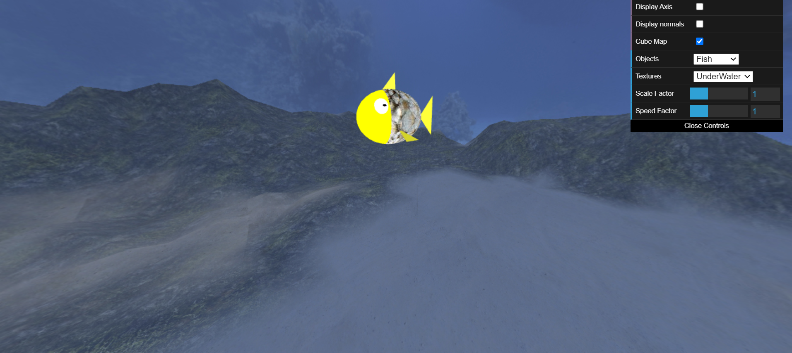
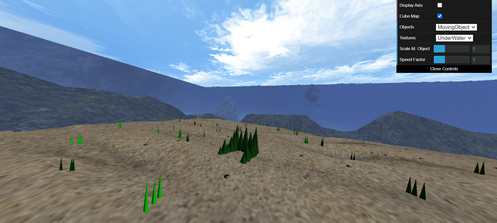
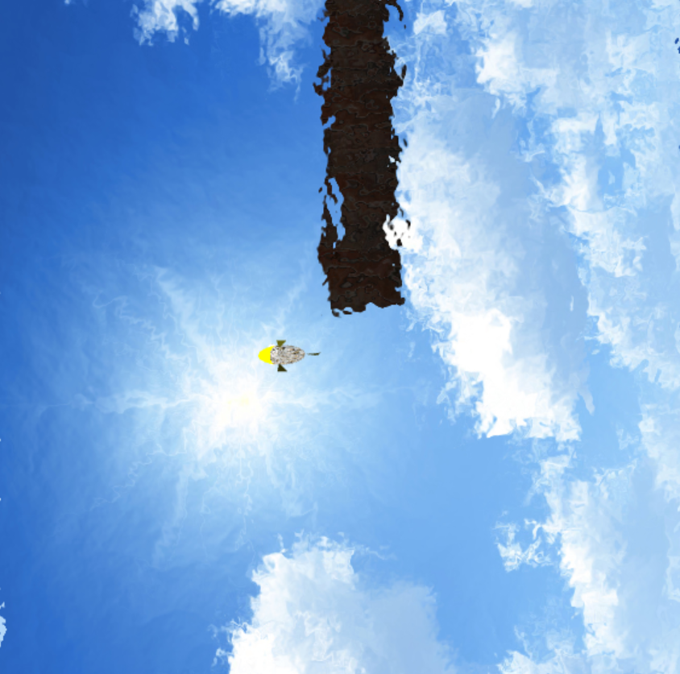
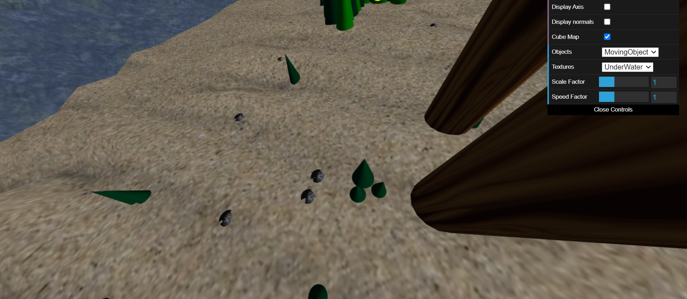
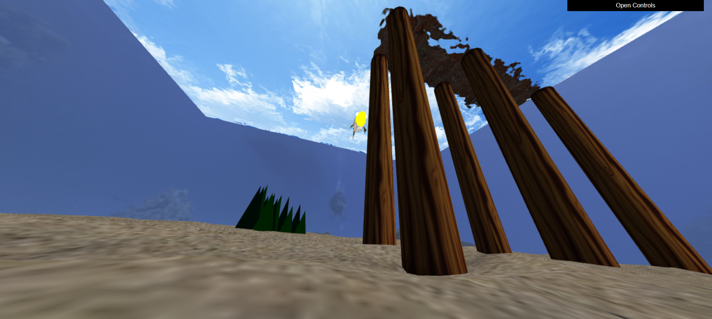
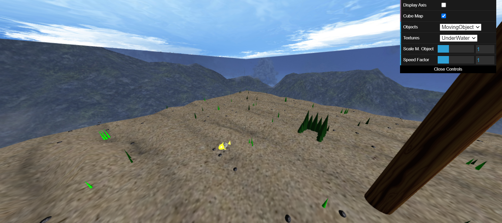
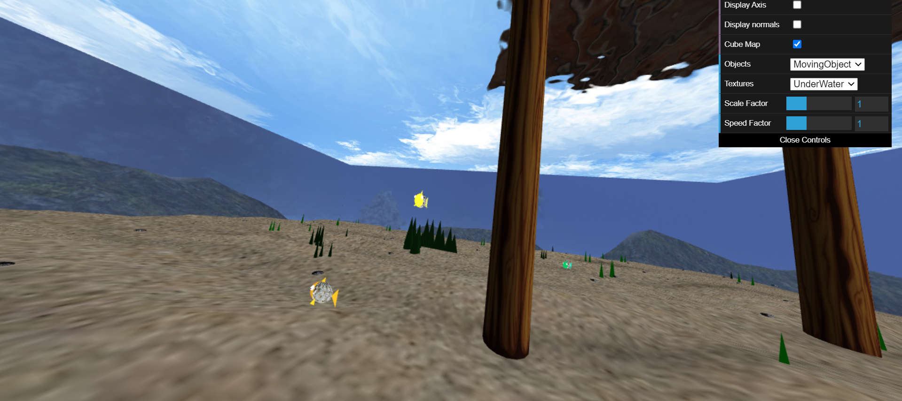

# CGRA 2020/2021

### Group T04G07

## Project by
André Costa (up201905916)

Isabel Silva (up201904925)

## Project Notes
The project is done for the maximum score of 19.5.

We found some complications in the following exercises:

 - In 5.1 and 5.2 we had some difficulties to apply the shaders properly.
 
 - There were also some complications at 6.3, because of the way we were generating the stones.
Then we changed our approach and solved the problem we were having before.

 - Finally, some complications showed up while doing the additional feature 7.4.
 We weren't being able to finish this point so we decided to do 7.3 instead.
 The only issue is that the work is not done in order to try to get the maximum score of 20, but for 19.5.
 We made this decision having in consideration what we still needed to finish and the time we had left.

In the additional features the points approached were 7.1, 7.3 and 7.5.

## ScreenShots

### 1 - MyFish

### 2 - Sea Floor

### 3 - Water Surface

### 4 - Rocks

### 5 - Pillars

### 6 - Other Elements

#### 6.3 - Stones Collection
Fish transporting the stone above him.
.png)

Stones at the nest.
.png)

### 7 - Additional Features
#### 7.1 - Seaweed
.png)

### 7.3 - Placing the stones on the target
.png)

#### 7.5 - Animated fishes

